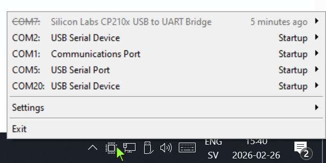

Detects & displays serial ports connected or removed from your Windows system.
Small Windows tray app that shows which COM port was assigned when a USB serial device connects or disconnects.

## Who this helps

* Developers working with Arduino, Teensy, FTDI, and similar serial devices
* Labs or workshops with many boards connected at once
* Larger projects where multiple serial endpoints are active and port numbers shift

## Why

I work frequently with serial ports (Arduino, Teensy, FTDI, custom boards).
I always have several ports connected at once, and during some projects I may have 10 or more ports available.
When connecting new devices, a recurring problem is not knowing which port was assigned to my newly connected device, as it may or may not have been connected before.
This program displays pop-ups with port names for newly connected devices and additionally displays a chronologically sorted list of all connected ports.

## Features

* **Zero** background CPU use (no polling - uses device list update notifications)
* Uses **very little RAM** (slim, native C executable)
* Does not interfere with other applications (does not open or otherwise touch the ports)
* Discrete UI (goes in notification area, discrete Windows 10/11 style icon)
* Chronological list with relative timestamps (newest on top)
* Disconnected port tracking with configurable hide/timeout
* Sub-menus to get COM ports and hardware IDs to clipboard

## TODO

This application is very simple and convers my basic needs only.  
  
Ideas for improvement:

* Support for other operating systems
* Display additional port information
* Directly launch serial terminal or other application by clicking
* More configuration options

## How to install and use

* Download source and compile using gcc (tested with MSYS2 UCRT64; ensure gcc is on PATH; see make.bat), or download the binary
* Place both executables anywhere you like (program files is an excellent choice)
* Run the program
* Optional: Set up the notification icon to always be displayed  
  Follow https://support.microsoft.com/en-us/help/30031/windows-10-customize-taskbar-notification-area
* Right click the icon for a chronological list of connected ports (new at top)
* Use Settings to control Notification mode, disconnected port behavior, and start-with-Windows
